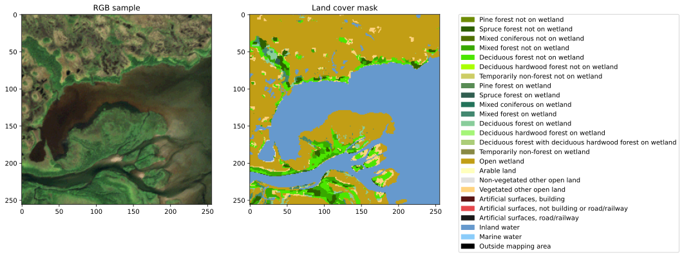
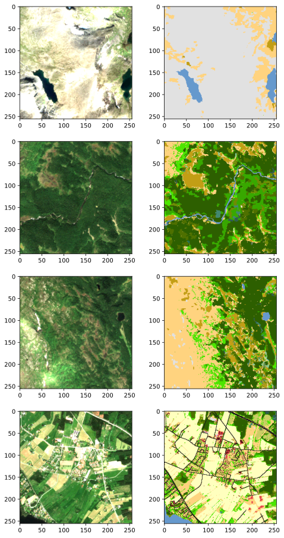

# **ML-enhanced remote sensing with multi-spectral imagery from Sentinel-2**
The Pytorch implementation in this project is based off of https://github.com/victoresque/pytorch-template

## **The dataset**
Satellite imagery is sourced from Sentinel-L2A with SentinelHub. The land cover classification mask is downloaded from Naturvårdsverket.

#### **Some samples**

#### **Producing the dataset**